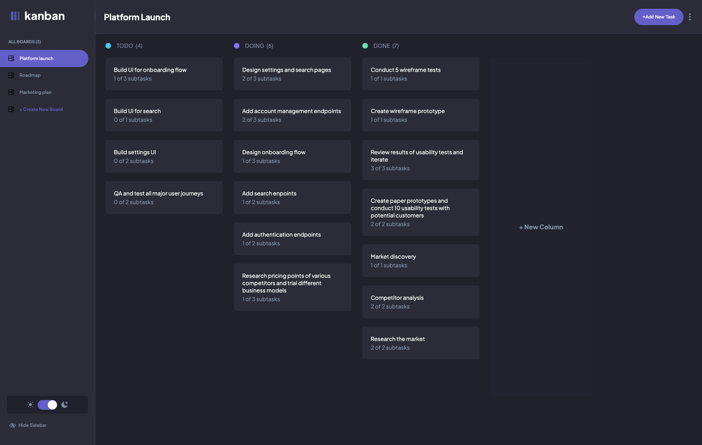
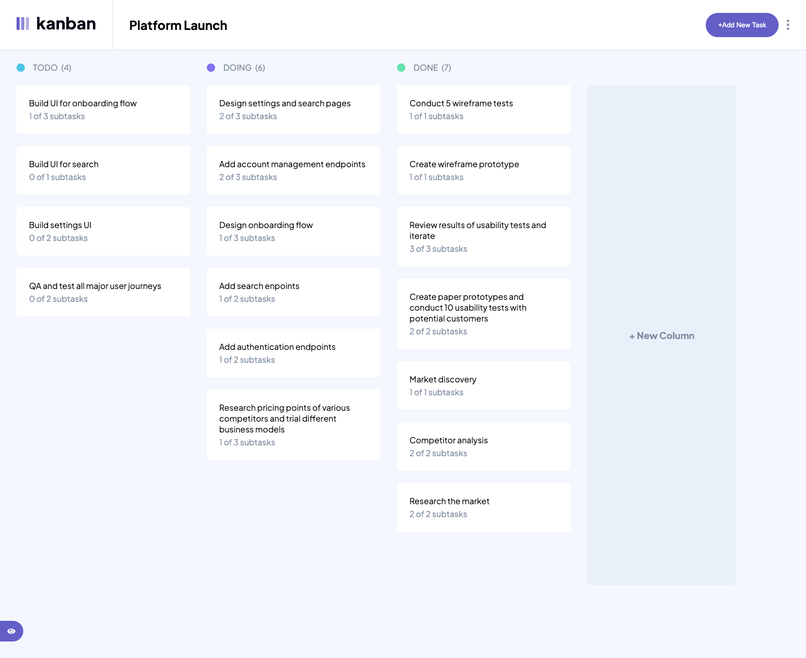
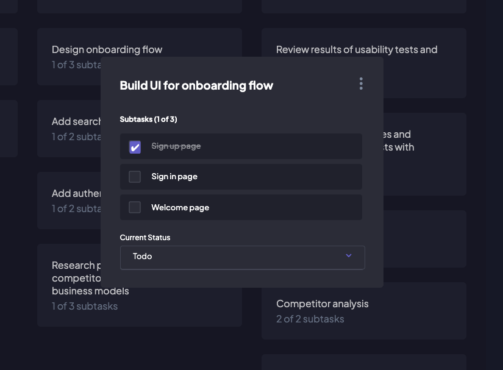
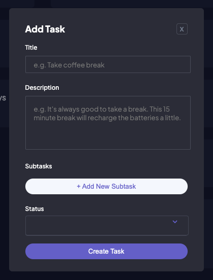
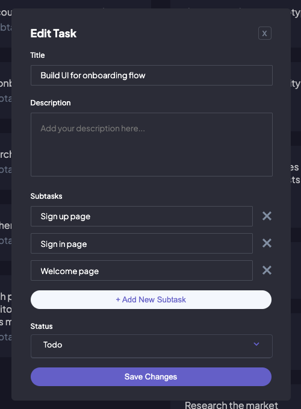
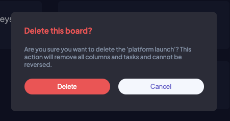

## Kanban Scheduling App

Kanban Task Scheduling Application. For tracking the progression of tasks through to completion.

## Table of contents:
- [Kanban Scheduling App](#kanban-scheduling-app)
- [Table of contents:](#table-of-contents)
- [Task](#task)
- [Expected Behaviour](#expected-behaviour)
- [Screenshot](#screenshot)
- [Tech Stack](#tech-stack)
- [What I learned](#what-i-learned)
- [Deploy on Vercel](#deploy-on-vercel)

## Task

Your challenge is to build out this task management app and get it looking as close to the design as possible.

You can use any tools you like to help you complete the challenge. So if you've got something you'd like to practice, feel free to give it a go.

We provide the data in a local `data.json` file, so use that to populate the content on the first load. If you want to take it up a notch, feel free to build this as a full-stack application!

**Your users should be able to:**

- See hover states for all interactive elements on the page
- Create, read, update, and delete boards and tasks
- Receive form validations when trying to create/edit boards and tasks
- Mark subtasks as complete and move tasks between columns
- Hide/show the board sidebar
- Toggle the theme between light/dark modes
- **In Development:** View the optimal layout for the app depending on their device's screen size
- **In Development:** Allow users to drag and drop tasks to change their status and re-order them in a column

## Expected Behaviour

- **Boards:**
  - Clicking different boards in the sidebar will change to the selected board.
  - Clicking "Create New Board" in the sidebar opens the "Add New Board" modal.
  - Clicking in the dropdown menu "Edit Board" opens up the "Edit Board" modal where details can be changed.
  - Columns are added and removed for the Add/Edit Board modals.
  - Deleting a board deletes all columns and tasks and requires confirmation.
- **Columns:**
  - A board needs at least one column before tasks can be added. If no columns exist, the "Add New Task" button in the header is disabled.
  - Clicking "Add New Column" opens the "Edit Board" modal where columns are added.
- **Tasks:**
  - Adding a new task adds it to the bottom of the relevant column.
  - Updating a task's status will move the task to the relevant column. If you're taking on the drag and drop bonus, dragging a task to a different column will also update the status.

## Screenshot

## Tech Stack

- NextJS 14 with App Router
- SASS, Global Variables & CSS Modules
- PostgreSQL hosted at Railway.app

## What I learned

With every app I work on, I am continually reminded of the importance of planning. It may take longer in the beginning but saves time in the long run. Thinking through both the schema and data flow, will limit the amount of refactoring required during the build process.

## Deploy on Vercel

https://kanban-scheduling-app-next-ts-git-convert-to-js-chrtravels.vercel.app/
